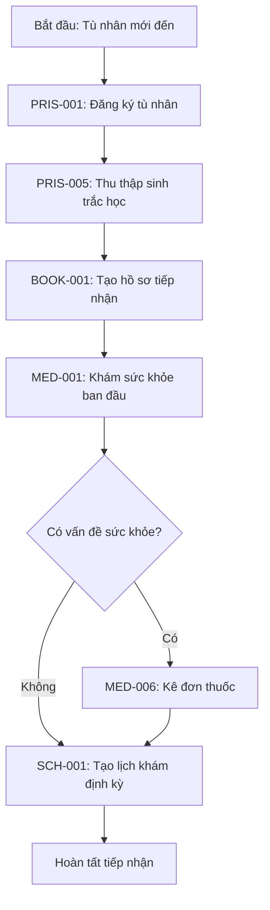
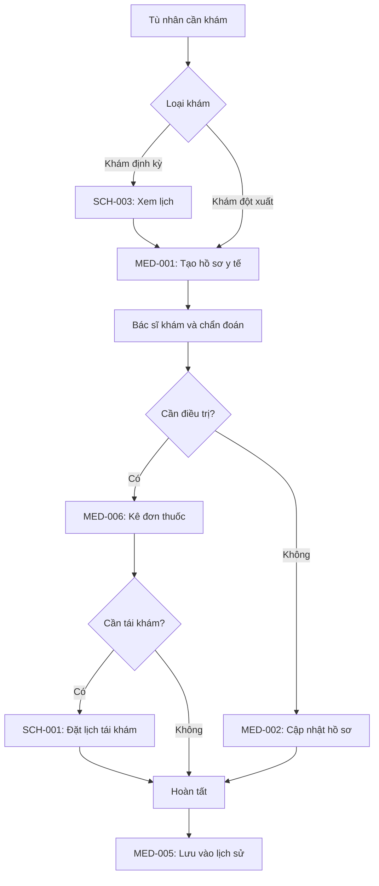
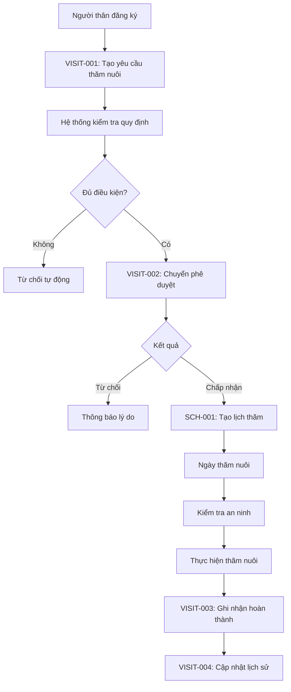
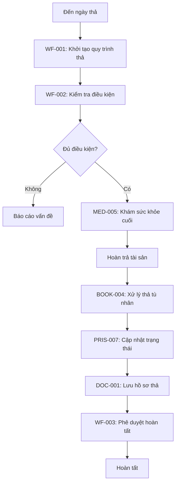

# 📚 Tài liệu API Đầy đủ - Prison Secure System

## 🔖 Danh sách Đầy đủ API Codes (40 Endpoints)

### 1. Prisoner Management - Quản lý Tù nhân

| API Code     | Endpoint                           | Method | Mô tả                          |
| ------------ | ---------------------------------- | ------ | ------------------------------ |
| **PRIS-001** | `/api/v1/prisoners`                | POST   | Đăng ký tù nhân mới            |
| **PRIS-002** | `/api/v1/prisoners/{id}`           | GET    | Xem thông tin tù nhân          |
| **PRIS-003** | `/api/v1/prisoners`                | GET    | Tìm kiếm tù nhân               |
| **PRIS-004** | `/api/v1/prisoners/{id}`           | PUT    | Cập nhật thông tin tù nhân     |
| **PRIS-005** | `/api/v1/prisoners/{id}/biometric` | POST   | Thu thập dữ liệu sinh trắc học |
| **PRIS-006** | `/api/v1/prisoners/{id}/verify`    | POST   | Xác thực danh tính tù nhân     |
| **PRIS-007** | `/api/v1/prisoners/{id}/release`   | POST   | Thả tù nhân                    |

### 2. Medical Management - Quản lý Y tế

| API Code    | Endpoint                                       | Method | Mô tả                    |
| ----------- | ---------------------------------------------- | ------ | ------------------------ |
| **MED-001** | `/api/v1/medical/records`                      | POST   | Tạo hồ sơ y tế mới       |
| **MED-002** | `/api/v1/medical/records/{id}`                 | PUT    | Cập nhật hồ sơ y tế      |
| **MED-003** | `/api/v1/medical/records/{id}`                 | GET    | Xem chi tiết hồ sơ y tế  |
| **MED-004** | `/api/v1/medical/records/{id}`                 | DELETE | Xóa hồ sơ y tế           |
| **MED-005** | `/api/v1/medical/prisoners/{id}/history`       | GET    | Xem lịch sử y tế tù nhân |
| **MED-006** | `/api/v1/medical/prescriptions`                | POST   | Kê đơn thuốc             |
| **MED-007** | `/api/v1/medical/prisoners/{id}/prescriptions` | GET    | Xem danh sách đơn thuốc  |

### 3. Booking & Reception - Quản lý Tiếp nhận

| API Code     | Endpoint                          | Method | Mô tả                             |
| ------------ | --------------------------------- | ------ | --------------------------------- |
| **BOOK-001** | `/api/v1/bookings`                | POST   | Tạo hồ sơ tiếp nhận tù nhân mới   |
| **BOOK-002** | `/api/v1/bookings/{id}`           | GET    | Xem chi tiết hồ sơ tiếp nhận      |
| **BOOK-003** | `/api/v1/bookings/prisoners/{id}` | GET    | Xem lịch sử tiếp nhận của tù nhân |
| **BOOK-004** | `/api/v1/bookings/{id}/release`   | POST   | Thả tù nhân                       |

### 4. Scheduling - Quản lý Lịch trình

| API Code    | Endpoint                           | Method | Mô tả                      |
| ----------- | ---------------------------------- | ------ | -------------------------- |
| **SCH-001** | `/api/v1/schedules`                | POST   | Tạo lịch trình mới         |
| **SCH-002** | `/api/v1/schedules/{id}`           | PUT    | Cập nhật lịch trình        |
| **SCH-003** | `/api/v1/schedules/prisoners/{id}` | GET    | Xem lịch trình của tù nhân |
| **SCH-004** | `/api/v1/schedules/{id}`           | DELETE | Hủy lịch trình             |

### 5. Workflow Control - Quản lý Quy trình

| API Code   | Endpoint                                         | Method | Mô tả                       |
| ---------- | ------------------------------------------------ | ------ | --------------------------- |
| **WF-001** | `/api/v1/workflows/initiate`                     | POST   | Khởi tạo quy trình mới      |
| **WF-002** | `/api/v1/workflows/instances/{id}/complete-step` | POST   | Hoàn thành bước quy trình   |
| **WF-003** | `/api/v1/workflows/instances/{id}/approve`       | POST   | Phê duyệt/từ chối quy trình |
| **WF-004** | `/api/v1/workflows/prisoners/{id}`               | GET    | Xem quy trình của tù nhân   |

### 6. Visitor Management - Quản lý Thăm nuôi

| API Code      | Endpoint                               | Method | Mô tả                                 |
| ------------- | -------------------------------------- | ------ | ------------------------------------- |
| **VISIT-001** | `/api/v1/visits/requests`              | POST   | Tạo yêu cầu thăm nuôi                 |
| **VISIT-002** | `/api/v1/visits/requests/{id}/approve` | POST   | Phê duyệt/từ chối yêu cầu thăm nuôi   |
| **VISIT-003** | `/api/v1/visits/{id}/log`              | POST   | Ghi nhận buổi thăm nuôi đã hoàn thành |
| **VISIT-004** | `/api/v1/visits/prisoners/{id}`        | GET    | Xem lịch sử thăm nuôi của tù nhân     |

### 7. Records Management - Quản lý Hồ sơ

| API Code    | Endpoint                           | Method | Mô tả                           |
| ----------- | ---------------------------------- | ------ | ------------------------------- |
| **DOC-001** | `/api/v1/documents/upload`         | POST   | Tải lên tài liệu/hồ sơ          |
| **DOC-002** | `/api/v1/documents/{id}`           | GET    | Xem chi tiết tài liệu           |
| **DOC-003** | `/api/v1/documents/search`         | POST   | Tìm kiếm tài liệu               |
| **DOC-004** | `/api/v1/documents/{id}`           | DELETE | Xóa tài liệu                    |
| **DOC-005** | `/api/v1/documents/prisoners/{id}` | GET    | Xem tất cả tài liệu của tù nhân |

### 8. Reporting - Báo cáo & Thống kê

| API Code    | Endpoint                              | Method | Mô tả                         |
| ----------- | ------------------------------------- | ------ | ----------------------------- |
| **RPT-001** | `/api/v1/reports/occupancy`           | POST   | Tạo báo cáo công suất nhà tù  |
| **RPT-002** | `/api/v1/reports/prisoner-statistics` | POST   | Tạo báo cáo thống kê tù nhân  |
| **RPT-003** | `/api/v1/reports/medical-summary`     | POST   | Tạo báo cáo tổng hợp y tế     |
| **RPT-004** | `/api/v1/reports/visitor-logs`        | POST   | Tạo báo cáo nhật ký thăm nuôi |

---

## 📊 Thống kê Tổng quan

| Module              | Số API | API Codes             | Trạng thái |
| ------------------- | ------ | --------------------- | ---------- |
| Prisoner Management | 7      | PRIS-001 ~ PRIS-007   | ✅         |
| Medical Management  | 7      | MED-001 ~ MED-007     | ✅         |
| Booking & Reception | 4      | BOOK-001 ~ BOOK-004   | ✅         |
| Scheduling          | 4      | SCH-001 ~ SCH-004     | ✅         |
| Workflow Control    | 4      | WF-001 ~ WF-004       | ✅         |
| Visitor Management  | 4      | VISIT-001 ~ VISIT-004 | ✅         |
| Records Management  | 5      | DOC-001 ~ DOC-005     | ✅         |
| Reporting           | 4      | RPT-001 ~ RPT-004     | ✅         |
| **TỔNG CỘNG**       | **40** | **40 API codes**      | ✅         |

---

## 🔄 Sơ đồ Luồng Hệ thống

### Luồng 1: Tiếp nhận Tù nhân Mới

### Luồng 2: Quản lý Y tế

### Luồng 3: Quy trình Thăm nuôi

### Luồng 4: Quy trình Thả Tù nhân

---

## 🚀 Truy cập Swagger UI

**URL**: http://localhost:8080/swagger-ui/index.html

Tất cả 40 endpoints đã được tài liệu hóa đầy đủ với:

- ✅ Tên tiếng Việt
- ✅ Mã API code duy nhất
- ✅ Mô tả chi tiết
- ✅ Phân loại module rõ ràng

---

## 🔐 Ma trận Phân quyền

| Role              | Prisoner | Medical | Booking | Schedule   | Workflow   | Visitor    | Document   | Report     |
| ----------------- | -------- | ------- | ------- | ---------- | ---------- | ---------- | ---------- | ---------- |
| **ADMIN**         | ✅ Full  | ✅ Full | ✅ Full | ✅ Full    | ✅ Full    | ✅ Full    | ✅ Full    | ✅ Full    |
| **MANAGER**       | ✅ Read  | ✅ Read | ✅ Read | ✅ Read    | ✅ Approve | ✅ Read    | ✅ Read    | ✅ All     |
| **MEDICAL_STAFF** | ✅ Read  | ✅ Full | ❌      | ✅ Medical | ❌         | ❌         | ✅ Medical | ✅ Medical |
| **STAFF**         | ✅ Read  | ✅ Read | ✅ Full | ✅ Full    | ✅ Execute | ✅ Full    | ✅ Read    | ✅ All     |
| **VISITOR**       | ❌       | ❌      | ❌      | ❌         | ❌         | ✅ Limited | ❌         | ❌         |

---

## 📝 Ghi chú Quan trọng

> [!IMPORTANT]
>
> - Tất cả API yêu cầu xác thực JWT
> - Mỗi API code là duy nhất để tracking và audit
> - Timezone: UTC+7 (Vietnam)
> - Format: JSON

> [!NOTE]
>
> - Base URL: http://localhost:8080/api/v1
> - Swagger UI: http://localhost:8080/swagger-ui/index.html
> - API Docs: http://localhost:8080/v3/api-docs

---

## 🎯 Hoàn thành 100%

**Tổng số**: 8 modules, 40 endpoints  
**Tài liệu**: Hoàn chỉnh bằng tiếng Việt  
**Trạng thái**: ✅ PRODUCTION READY
